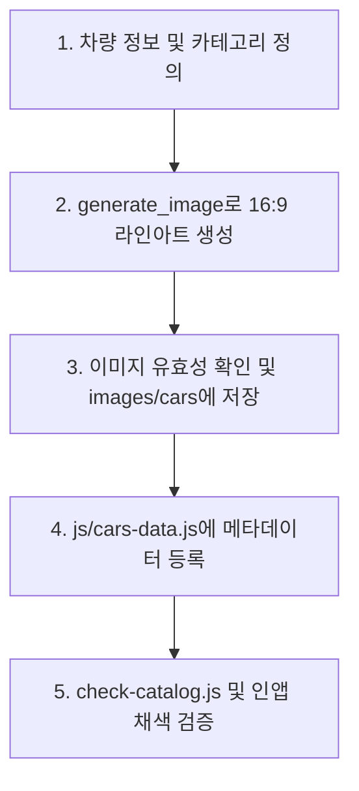

# 자동차 색칠 도안 생성 및 등록 스킬 (Car Coloring Page Generator)

`Car Coloring Studio` 프로젝트의 디자인 시스템과 16:9 캔버스 엔진 규격에 맞는 고품질 라인아트 자동차 색칠 도안을 생성하고, 메타데이터를 카탈로그에 등록하는 표준 워크플로우를 제공합니다.

---

## 🚀 빠른 시작 가이드 (Quick Workflow)

새로운 자동차 색칠 도안을 제작할 때는 아래 5단계 프로세스를 순서대로 수행합니다.



---

## 📋 단계별 상세 절차

### 1단계: 차량 스펙 및 메타데이터 정의

새로 추가할 차량의 기본 정보를 정리합니다:
- **`id`**: 소문자 snake_case 고유 식별자 (예: `genesis_gv70`, `ioniq5`, `ferrari_roma`)
- **`category`**: 7대 분류 중 1개 (`sedan`, `suv_mpv`, `sports`, `truck`, `bus`, `special`, `micro`)
- **`name` / `nameEn`**: 한글명 및 공식 영문 모델명
- **`difficulty`**: `쉬움` | `보통` | `어려움 (정밀)`
- **`defaultColor` / `accentColor`**: 어울리는 추천 HEX 컬러 2종
- 상세 스키마는 [data-schema.md](./references/data-schema.md)를 참조하세요.

---

### 2단계: `generate_image` 도구를 사용한 라인아트 도안 생성

`images/cars/`의 기존 도안들과 시각적 일관성을 유지하기 위해 아래 공식 프롬프트 템플릿을 사용합니다:

#### 🎯 도안 생성 프롬프트 공식
```text
A coloring book page for kids and adults, clean black and white line art of a [정확한 차량 모델 영문명], [차량의 대표 외관 특징 3~4가지]. Dynamic 3/4 front angle view, centered composition. Crisp bold black outlines, clear closed contours suitable for paint bucket fill, pure white interior panels, no colors, no grayscale shading, no gradients, no textures, minimal clean ground line beneath the tires, pure solid white background, 8k resolution vector style coloring sheet.
```

#### ⚙️ `generate_image` 파라미터 규격
- **`Prompt`**: 위 공식에 맞춘 영문 프롬프트 (차종별 예시는 [prompt-recipes.md](./references/prompt-recipes.md) 참조)
- **`AspectRatio`**: `'16:9'` (필수)
- **`ImageName`**: `<category>_<id>` (예: `sedan_ioniq5`, `sports_sf90`)

---

### 3단계: 도안 이미지 검증 및 저장

1. **외곽선 품질 점검**:
   - 페인트통(Flood Fill) 채색 시 색이 새지 않도록 주요 부품(도어, 보닛, 휠, 범퍼, 윈도우 등)의 외곽선이 닫힌 형태(Closed Loop)인지 확인합니다.
   - 불필요한 음영(그라데이션, 하프톤 망점, 빗금) 없이 순백색 내부가 유지되었는지 확인합니다.
2. **대상 경로에 이미지 배치**:
   - 생성된 이미지를 프로젝트 내 `images/cars/<category>/<id>.jpg` 경로로 복사 또는 저장합니다.

---

### 4단계: `js/cars-data.js` 카탈로그 등록

등록 도구 스크립트([register-car.js](./scripts/register-car.js))를 실행하거나 `js/cars-data.js`의 `CARS_DATA` 배열에 새 항목을 추가합니다.

```bash
# 자동 등록 스크립트 실행 예시
node .agents/skills/car-coloring-page/scripts/register-car.js \
  --id ioniq5 \
  --name "현대 아이오닉 5" \
  --nameEn "Hyundai Ioniq 5 EV" \
  --category sedan \
  --difficulty "보통" \
  --desc "파라메트릭 픽셀 램프와 에어로 다이내믹 실루엣의 첨단 전기 CUV" \
  --image "images/cars/sedan/ioniq5.jpg" \
  --defaultColor "#00f0ff" \
  --accentColor "#1c1c1e"
```

---

### 5단계: 도안 무결성 검증

카탈로그 점검 도구([check-catalog.js](./scripts/check-catalog.js))를 실행하여 누락된 항목이나 깨진 이미지 링크가 없는지 점검합니다:

```bash
node .agents/skills/car-coloring-page/scripts/check-catalog.js
```

- 점검 완료 후 `npm start`로 로컬 서버를 구동하고 브라우저에서 새 도안을 선택하여 **스마트 페인트통(Flood Fill)** 및 **브러시 드로잉**이 정상 작동하는지 확인합니다.

---

## 📚 참조 문서 및 도구

- [차종별 프롬프트 레시피 모음](./references/prompt-recipes.md): 세단, SUV, 슈퍼카, 상용차, 중장비 등 차종별 최적화 프롬프트 모음
- [메타데이터 스키마 규격](./references/data-schema.md): `CARS_DATA` 스키마, 7대 카테고리 매핑, 난이도 및 컬러 추천표
- [카탈로그 검증 스크립트](./scripts/check-catalog.js): 도안 누락 및 이미지 해상도/비율 검사 도구
- [도안 자동 등록 스크립트](./scripts/register-car.js): `js/cars-data.js` 메타데이터 자동 추가 CLI 도구
